# Real-World Digit Recognition using CNN

## 📋 Project Overview

This project implements a **Convolutional Neural Network (CNN)** for recognizing digits (1-9) from **real-world images**. The model is trained on custom dataset images and can accurately predict digits from photographs, screenshots, and other real-world sources after preprocessing them to MNIST-like format.

## 🎯 Key Features

- **Custom CNN Architecture**: Deep learning model with 2 convolutional layers
- **Image Preprocessing Pipeline**: Converts real images to MNIST-like format (28x28 grayscale)
- **Data Augmentation**: Rotation-based augmentation to increase training samples
- **GUI Application**: Tkinter-based interface for easy digit prediction
- **Pre-trained Model**: Ready-to-use model saved as `my_model6.npz`

## 📁 Project Structure

```
├── train.ipynb          # Main training notebook with CNN implementation
├── my_model6.npz        # Pre-trained model (ready to use)
├── dataset/             # Training images (1.png to 9.png + test images)
└── README.md            # Project documentation
```

## 🧠 Model Architecture

The CNN model consists of:

1. **Input Layer**: 28x28x1 grayscale images
2. **Conv2D Layer 1**: 32 filters (3x3), ReLU activation
3. **MaxPooling2D**: 2x2 pool size
4. **Conv2D Layer 2**: 64 filters (3x3), ReLU activation
5. **MaxPooling2D**: 2x2 pool size
6. **Flatten Layer**: Converts 2D features to 1D
7. **Dense Layer**: 64 neurons, ReLU activation
8. **Output Layer**: 9 neurons (digits 1-9), Softmax activation

**Total Parameters**: ~121,865

## 🔧 Technologies Used

- **TensorFlow/Keras**: Deep learning framework
- **OpenCV (cv2)**: Image processing
- **NumPy**: Numerical computations
- **Matplotlib**: Visualization
- **Tkinter**: GUI interface
- **Pillow (PIL)**: Image handling
- **scikit-learn**: Data splitting

## 📊 Dataset

- **Total Images**: 810 (after augmentation)
- **Training Set**: 640 images (80%)
- **Test Set**: 170 images (20%)
- **Image Size**: 28x28 pixels (grayscale)
- **Classes**: 9 (digits 1-9)

### Sample Images from Dataset

Here are examples of the real-world digit images used for training:

<div align="center">
  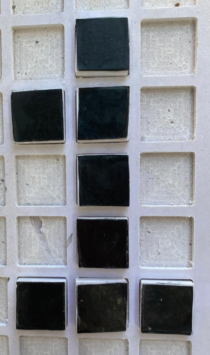
  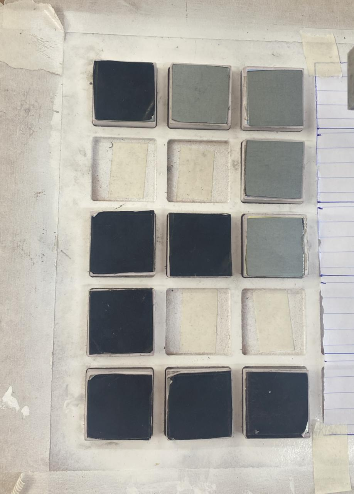
  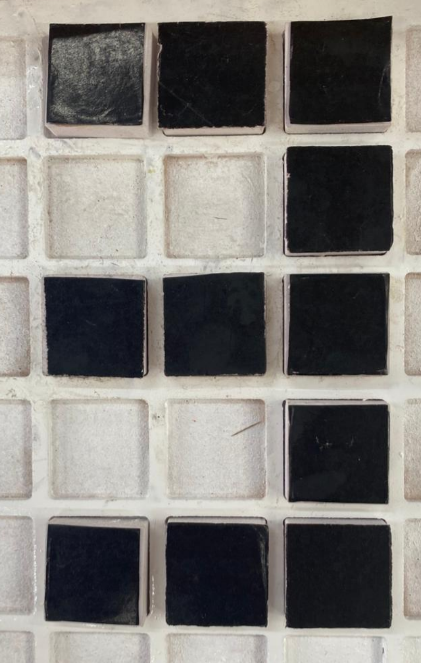
  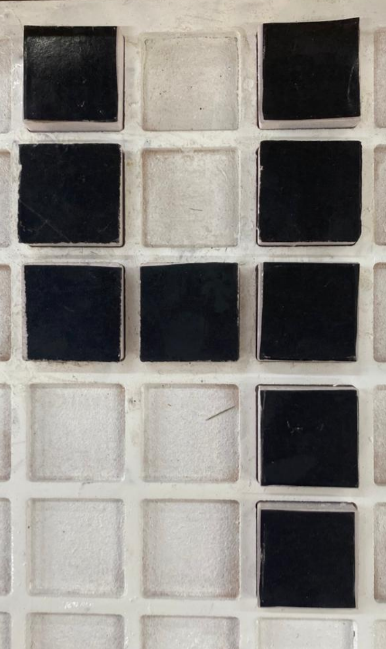
  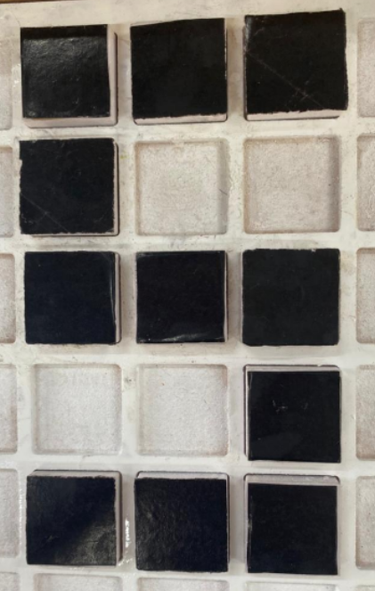
</div>

<div align="center">
  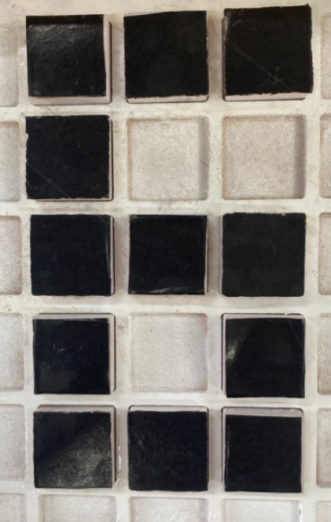
  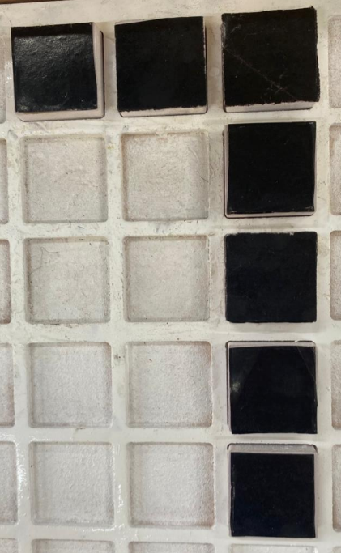
  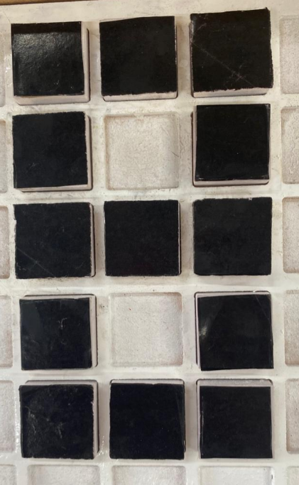
  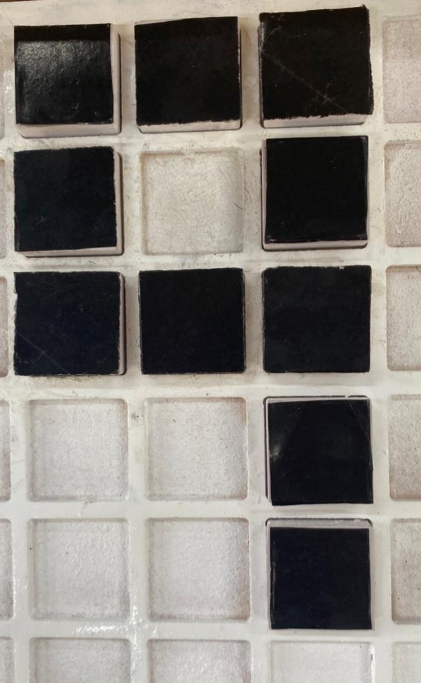
</div>

### Test Images

<div align="center">
  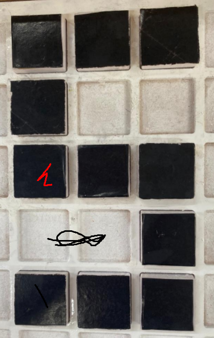
  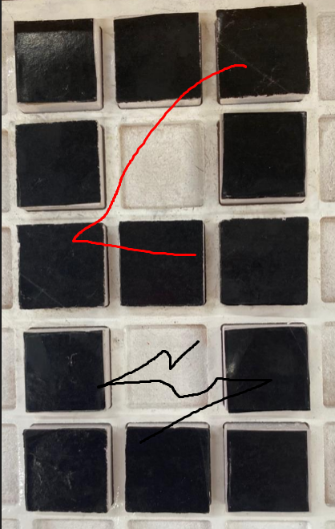
  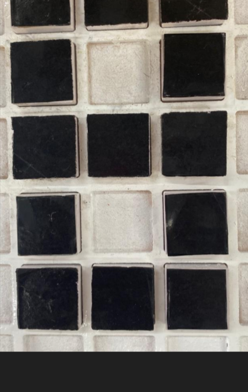
  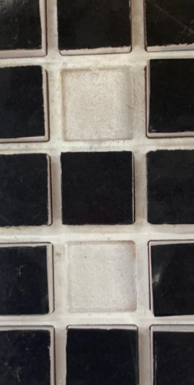
</div>

### Data Augmentation
Images are augmented using rotation at multiple angles: -20°, -15°, -10°, -5°, 5°, 10°, 15°, 20°

## 🚀 How to Use

### 1. Training the Model

Run the notebook cells in sequence:

```python
# Load and preprocess dataset
# Build CNN model
# Train the model (10 epochs, batch size 4)
# Evaluate and save model
```

### 2. Using Pre-trained Model

The `my_model6.npz` file contains the trained model weights and can be loaded directly for predictions.

### 3. Image Preprocessing Functions

The notebook includes utility functions for image preprocessing:

- `convert_real_image_to_mnist()`: Converts real images to MNIST format
- `fill_pixel_gaps()`: Fills gaps between white pixels using dilation
- `erode_white_area()`: Reduces white area using erosion
- `process_image()`: Complete preprocessing pipeline

### 4. GUI Application

Launch the Tkinter GUI to:
1. Load an image file (PNG, JPG, JPEG)
2. View the preprocessed image
3. Get top-3 predictions with confidence scores

## 📈 Model Performance

- **Optimizer**: Adam
- **Loss Function**: Sparse Categorical Crossentropy
- **Training Epochs**: 10
- **Batch Size**: 4
- **Final Validation Accuracy**: 100%

The model achieves high accuracy on the test set and can recognize digits from real-world images (photographs, screenshots, etc.) after preprocessing.

## 🖼️ Image Processing Pipeline

1. **Grayscale Conversion**: Convert RGB to grayscale
2. **Binary Thresholding**: Separate foreground from background
3. **Noise Removal**: Morphological operations (opening)
4. **Contour Detection**: Find digit boundaries
5. **Cropping & Centering**: Extract and center the digit
6. **Resizing**: Scale to 28x28 pixels
7. **Gaussian Blur**: Smooth edges for MNIST-like appearance
8. **Normalization**: Scale pixel values to [0, 1]

## 💻 Installation

```bash
pip install tensorflow opencv-python numpy matplotlib pillow scikit-learn scikit-image
```

## 🎮 Running the Application

```python
# Run the GUI application cell in the notebook
# Click "Load Image" button
# Select a digit image
# View prediction results
```

## 📝 Code Structure

The notebook contains:
- **Image preprocessing utilities** (Cells 0, 2, 4, 9)
- **Model loading and GUI** (Cells 1, 4, 9)
- **Data loading and augmentation** (Cell 20)
- **Model architecture definition** (Cell 21)
- **Training and evaluation** (Cells 22-26)
- **Visualization tools** (Cells 14, 15, 26)

## 🔍 Model Insights

- The model uses **sparse categorical crossentropy** as it works with integer labels (0-8 representing digits 1-9)
- **MaxPooling** reduces spatial dimensions and computational cost
- **Data augmentation** helps prevent overfitting with limited training data
- The preprocessing pipeline ensures consistency between training and inference

## 🌟 Future Improvements

- Expand dataset with more samples
- Add support for digit 0
- Implement real-time webcam digit recognition
- Deploy as web application
- Add support for multi-digit recognition

---

## 📄 License

This project is open-source and available for educational purposes.

## 👨‍💻 Author

**Zaid Abu Samra**
